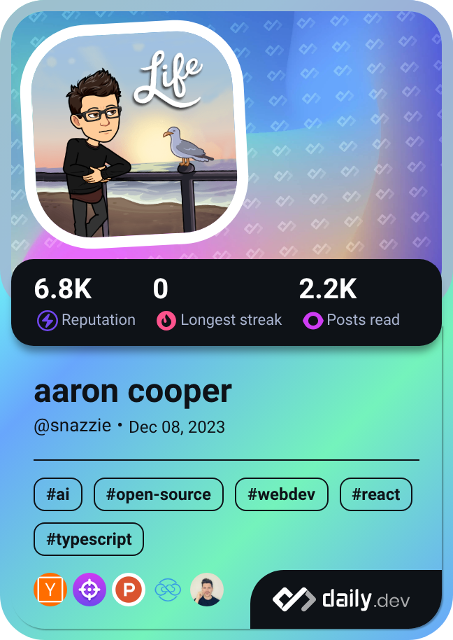

  <ul align="center" style="list-style: none">
    

      <h1>
        I am Snazzie
      </h1>
    

  </ul>

 

**<h3 align="left">Rapid Fire</h3>**

- 💼 I'm currently working on: **My startup cloudcat.dev**
- 🌱 I'm currently learning: **How to build and run a startup**
- 💬 Ask me about: **My startup cloudcat.dev**
- ⚡ Fun fact: **Im building the best cloud monitoring solution for everyone. **
- 📝 Blog: **<a href="cloudcat.dev/blogs" target="_blank">cloudcat.dev/blogs</a>**

 **<h3 align="left">Skills</h3>**

            

 **<h3 align="left">GitHub Stats</h3>**

  
  

  

|  |  |
|---------|-------|
|  #### My Laptop   Lenovo Yoga Slim 7x snapdragon 32gb mem   #### My Workstation * CPU: Ryzen 9 7950x * RAM: 4x16GB Corsair Vengeance 6000mhz cl36 * GPU: RTX 3080Ti FE  #### My Server Box * CPU: Ryzen 9 3900x * RAM: 4x16GB Corsair Vengeance 3200mhz cl16 * GPU: GTX 980Ti  I’m looking for collaborators for [Vital Utilities](https://github.com/Vital-Utilities) You can HMU via my linkedIn, email or through the appropriate discord server or dm (COOP#0812) |  |
