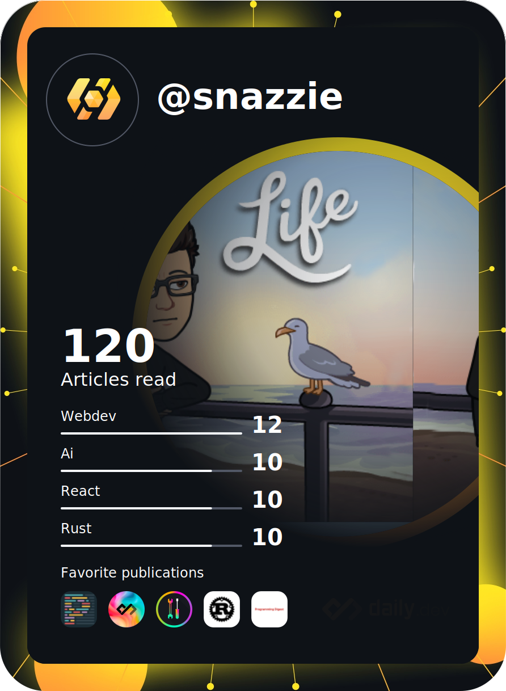

|  |  |
|---------|-------|
| ### Hi there 👋  #### My Workstation * CPU: Ryzen 9 7950x * RAM: 4x16GB Corsair Vengeance 6000mhz cl36 * GPU: RTX 3080Ti FE  #### My Server Box * CPU: Ryzen 9 3900x * RAM: 4x16GB Corsair Vengeance 3200mhz cl16 * GPU: GTX 980Ti  I’m looking for collaborators for [Vital Utilities](https://github.com/Vital-Utilities) You can HMU via my linkedIn, email or through the appropriate discord server or dm (COOP#0812) |  |
