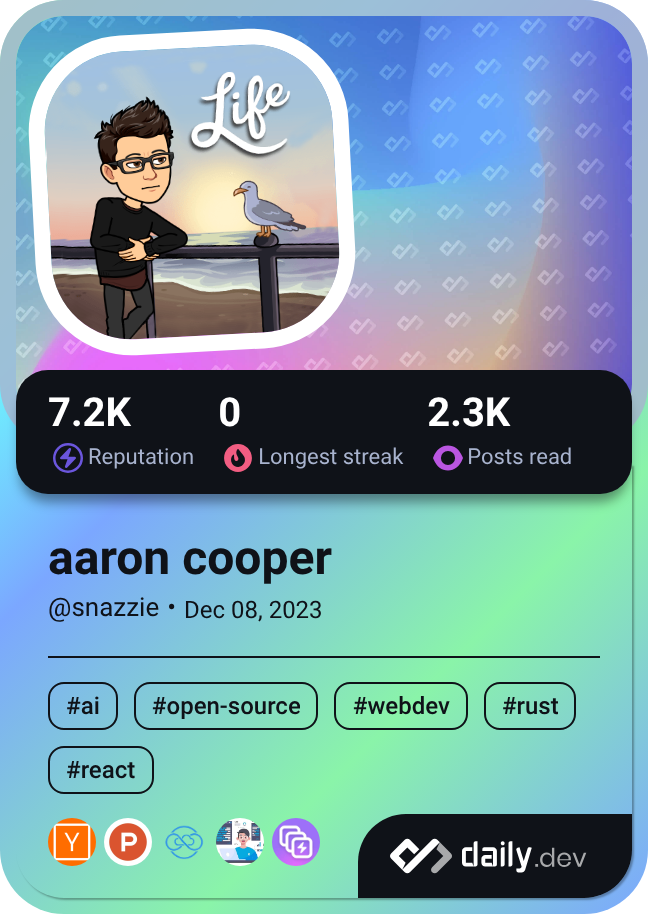

  <ul align="center" style="list-style: none">
    

      <h1>
        I am Snazzie
      </h1>
    

  </ul>

 

**<h3 align="left">Rapid Fire</h3>**

- 💼 I'm currently working on: **My startup cloudcat.dev and lunarportfolio**
- 🌱 I'm currently learning: **How to build and run a startup**
- 💬 Ask me about: **My startup projects  **<a href="https://cloudcat.dev" target="_blank">cloudcat.dev</a>** **<a href="https://lunarportfolio.com" target="_blank">lunarportfolio</a>****
- ⚡ Fun fact: **All my projects are based around data aggregation and visualisation lmao**

 **<h3 align="left">GitHub Stats</h3>**

  
  

|  |  |
|---------|-------|
|  #### My Laptop   m5 macbook pro 32gb mem   #### My Workstation * CPU: Ryzen 9 7950x * RAM: 4x16GB Corsair Vengeance 6000mhz cl36 * GPU: RTX 3080Ti FE  #### My Server Box * CPU: Ryzen 9 3900x * RAM: 4x16GB Corsair Vengeance 3200mhz cl16 * GPU: Intel Arc A380 |  |
